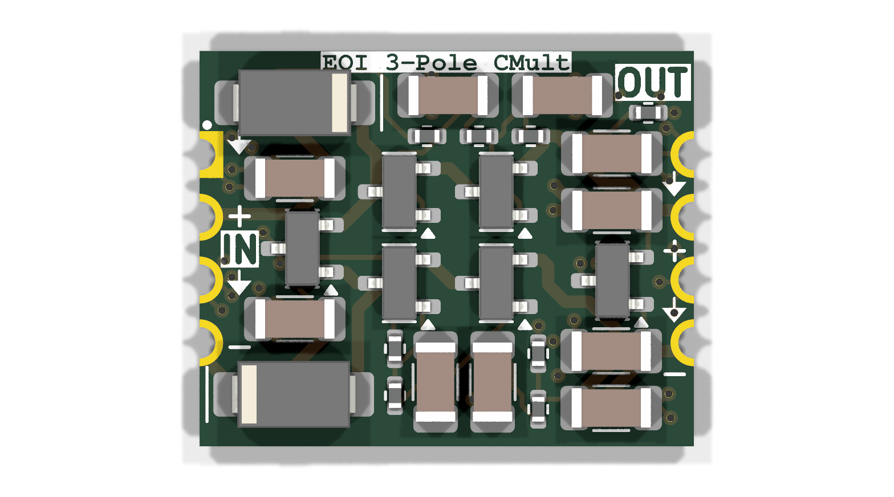
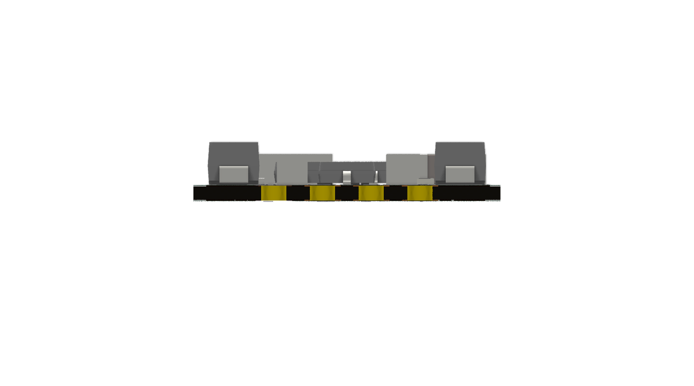
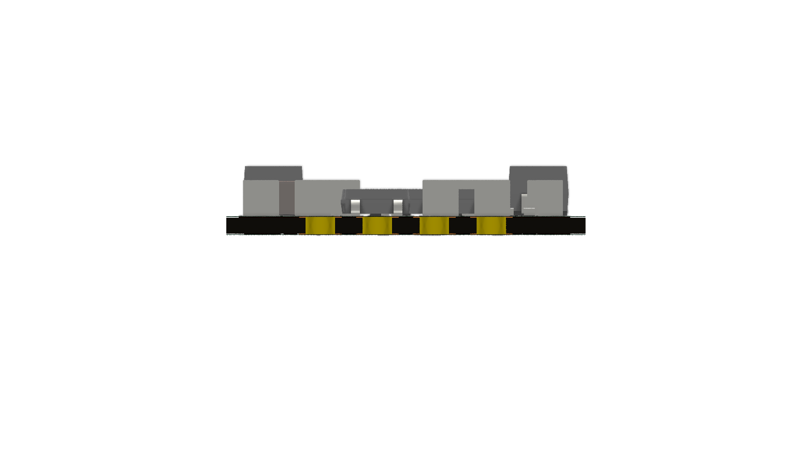
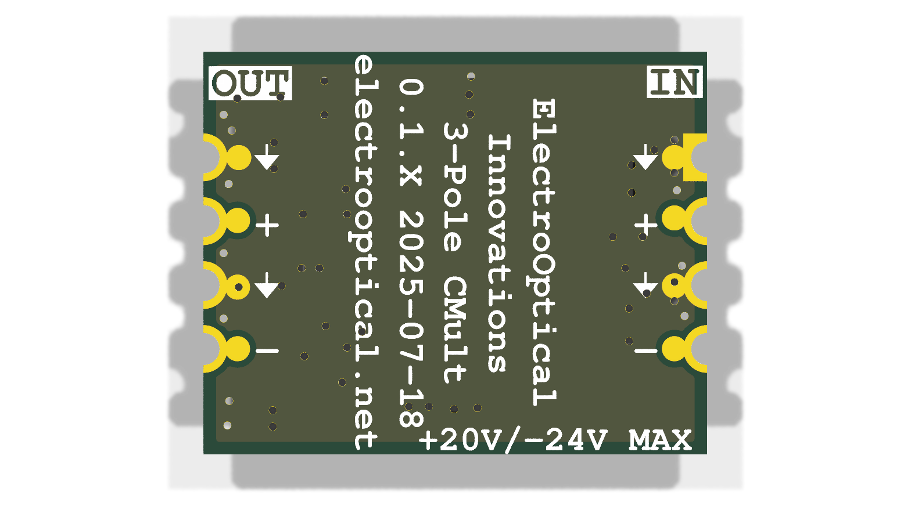

# Capacitance Multiplier Board
This is a 3-pole capacitance multiplier board for use with low noise instruments.
You sacrifice about a volt but get an incredibly quiet power supply.
This layout is intended to be used as a module and soldered to a target board using the castellated holes.

+ 3 Pole power supply filtering
+ Bipolar supplies up to +-20V. 
+ Reverse polarity protection
+ Extreme rejection of switch mode power supply frequencies

Used in our:

+ Low noise amplifiers
+ High gain photoreceivers
+ Low noise laser drivers

